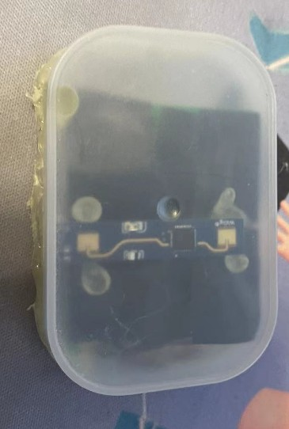

# esp01-esphome-ld2410

本项目是一个使用ld2410雷达和esp01制作的人体存在传感器并接入ESPHOME的简易说明，并提供ESPHOME配置文件。之前还需要搞驱动，现在esphome直接支持了方便了很多。

## 硬件

1. HLK-LD2410B 淘宝采购约22元，带B的是蓝牙版本，最好是买蓝牙的方便调试。

2. ESP-01/ESP-01S 我这里使用的是01 最后买01S 省着加电阻了，我主要是有存货，价格几乎一样，淘宝采购约5元

3. AMS1117-3.3V 降压模块，淘宝采购约0.8元

4. 10K 电阻两只，买01S可以不需要

5. CH340 usb 转 TTL/或esp01专用的下载器（贵，省事） 主要是用来给esp首次输入esphome用的，之后基本上就在线升级。

## 接线图

专业的图咱也不会画，凑合看吧。


## 组装硬件

我找了个万能版，把这些都焊在了一起，然后飞线。


成品，拿了一个棉签盒切了切，粘了粘，丑是丑点，又不是不能用。



## 刷入固件

首次刷入，需要使用CH340接入电脑，并连接上esp01。电脑装好CH340驱动

打开以下网址 https://web.esphome.io/?dashboard_wizard 选择相对应的端口输入即可

（这里写的草率了，偷懒~）

## 配置文件

```yaml

esphome:
  name: esphome-web-210be0
  friendly_name: 人体传感器

esp8266:
  board: esp01_1m

# Enable logging
logger:

# Enable Home Assistant API
api:
  encryption:
    key: ""

ota:


wifi:
  ssid: !secret wifi_ssid
  password: !secret wifi_password

  # Enable fallback hotspot (captive portal) in case wifi connection fails
  ap:
    ssid: "Esphome-Web-210Be0"
    password: "AOrdGd1o2cSQ"

captive_portal:

# 上面的代码都是基础代码，注意修改，wifi ssid 和 password


uart:
  id: uart1
  tx_pin: GPIO1
  rx_pin: GPIO3
  baud_rate: 256000
  parity: NONE
  stop_bits: 1

ld2410:
  uart_id: uart1 #指定串口 就是上面uart设置的ID
  timeout: 10s #无人持续时间(秒)，默认5秒,不宜设置的过小，以保证动态静态目标在短时间都丢失后给予一定的冗余
  max_move_distance : 3m #运动检测的最大距离 设置你想感应的范围
  max_still_distance: 3m #静态检测的最大距离 设置你想感应的范围
  g0_move_threshold: 50 # 动态感应门灵敏度，高于此值则触发 0米
  g0_still_threshold: 0 # 静态感应门灵敏度，高于此值则触发 0米
  g1_move_threshold: 40 # 0~0.75米
  g1_still_threshold: 40 # 0~0.75米
  g2_move_threshold: 40 # 0.75~1.5米
  g2_still_threshold: 40 # 0.75~1.5米
  g3_move_threshold: 40 # 1.5~2.25米
  g3_still_threshold: 40 # 1.5~2.25米
  g4_move_threshold: 40 # 2.25~3米
  g4_still_threshold: 40 # 2.25~3米
  g5_move_threshold: 40 # 3~3.75米
  g5_still_threshold: 100 # 3~3.75米 
  g6_move_threshold: 100 # 3.75~4.5米
  g6_still_threshold: 100 # 3.75~4.5米
  g7_move_threshold: 100 # 4.5~5.25米
  g7_still_threshold: 100 # 4.5~5.25米
  g8_move_threshold: 100 # 5.25~6米
  g8_still_threshold: 100 # 5.25~6米

sensor:
  - platform: ld2410
    moving_distance: #检测到的运动目标的距离（以厘米为单位）
      name: moving_distance
    still_distance: # 检测到的静止目标的距离
      name: still_distance
    moving_energy: # 运动目标的能量
      name: moving_energy
    still_energy: # 静止目标的能量
      name: still_energy
    detection_distance: # 目标的距离
      name: detection_distance

binary_sensor:
  - platform: ld2410
    has_moving_target: # 运动目标是否存在
      name: has_moving_target
    has_still_target: # 静止目标是否存在
      name: has_still_target
    has_target: # 静止或移动目标是否存在
      name: has_target
```

## 效果预览


需要做自动化主要使用 `has_target` 即可。